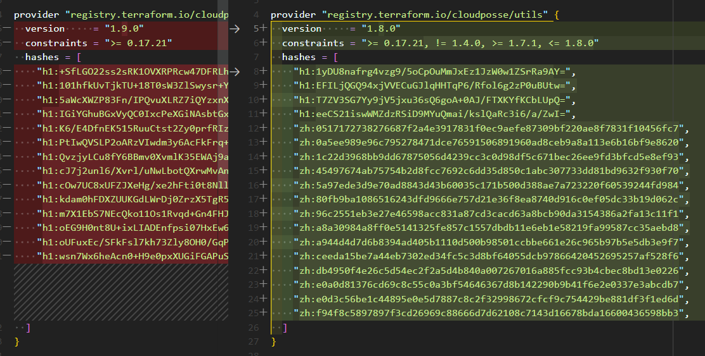

# Renovate ignore internal provider constraints

```bash
$ terraform providers

Providers required by configuration:
.
├── provider[registry.terraform.io/cloudposse/utils] >= 0.3.0
├── module.eks
│   ├── provider[registry.terraform.io/hashicorp/external] >= 2.0.0
│   ├── provider[registry.terraform.io/cloudposse/utils] != 1.4.0, >= 1.7.1, <= 1.8.0
│   ├── provider[registry.terraform.io/hashicorp/local] >= 1.3.0
│   ├── provider[terraform.io/builtin/terraform]
│   └── module.always
└── module.this
```

Compare Renovate update (right) and `terraform providers lock` results (left):


